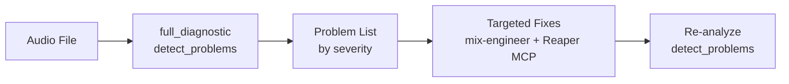

# Quick Reference: Diagnose and Fix Problems

> User says: "Something sounds wrong with this mix, can you check?"

## Prerequisites

Audio file or stems available. Phantom and a Reaper MCP server must both be connected. See [setup-guide.md](setup-guide.md).

## Pipeline

| Stage | Who | Action | Tool/Skill |
|-------|-----|--------|------------|
| 1. Scan | Phantom MCP | `full_diagnostic` on the audio file | audio-diagnostician |
| 2. Detect | Phantom MCP | `detect_problems` catalogs issues | audio-diagnostician |
| 3. Triage | Skill | Rank problems by severity | audio-diagnostician |
| 4. Fix | Skill + Reaper MCP | Address problems in severity order | mix-engineer |
| 5. Verify | Phantom MCP | `detect_problems` again to confirm fixes | audio-diagnostician |

## Signal Flow

## What Happens at Each Stage

1. **Scan** -- Run `full_diagnostic` for the complete picture: spectrum, loudness, dynamics, stereo, phase, and problems in one call.

2. **Detect** -- `detect_problems` catalogs issues by severity tier:
   - **Dealbreaker** -- clipping (true peak > 0 dBTP), DC offset, phase inversion, sample rate mismatch
   - **Significant** -- noise floor above -50 dBFS, mains hum, false stereo
   - **Moderate** -- sibilance, mud (200-500 Hz buildup), harshness (2-5 kHz), room resonances
   - **Minor** -- slight spectral imbalances, low-level clicks

3. **Triage** -- Address dealbreakers first, always. Then significant, then moderate. Minor issues are optional cleanup.

4. **Fix** -- Apply targeted fixes using recipes:
   - Masking problems: [sidechain_bass_to_kick](../../plugin/skills/mix-engineer/reaper-recipes.md) or [complementary_eq_pair](../../plugin/skills/mix-engineer/reaper-recipes.md)
   - Vocal issues: [create_vocal_chain](../../plugin/skills/mix-engineer/reaper-recipes.md)
   - Phase issues: flip polarity on the problem stem
   - DC offset: apply high-pass filter

5. **Verify** -- Run `detect_problems` again. Dealbreakers should be eliminated. Significant issues should be resolved or reduced.

## Cross-References

- [Mixing recipes](../../plugin/skills/mix-engineer/reaper-recipes.md) (sidechain_bass_to_kick, complementary_eq_pair, create_vocal_chain)
- [Audio diagnostician skill](../../plugin/skills/audio-diagnostician/SKILL.md)
- [Setup guide](setup-guide.md)

## Expected Time

Analysis: ~3-5 seconds. Fix operations: varies by problem count, typically ~2-5 seconds.
