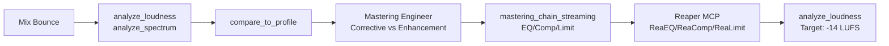

# Quick Reference: Mastering for Streaming

> User says: "Master this for Spotify"

## Prerequisites

Mix bounce ready. Phantom and a Reaper MCP server must both be connected. See [setup-guide.md](setup-guide.md).

## Pipeline

| Stage | Who | Action | Tool/Skill |
|-------|-----|--------|------------|
| 1. Analyze | Phantom MCP | `analyze_loudness` + `analyze_spectrum` on mix bounce | audio-diagnostician |
| 2. Compare | Phantom MCP | `compare_to_profile` against genre target | audio-diagnostician |
| 3. Assess | Skill | Decide corrective vs enhancement mastering | mastering-engineer |
| 4. Chain | Skill + Reaper MCP | Build mastering chain (9 stages) | mastering-engineer |
| 5. Target | Skill + Reaper MCP | Set limiter for -14 LUFS / -1.0 dBTP | mastering-engineer |
| 6. Verify | Phantom MCP | `analyze_loudness` confirms target LUFS | audio-diagnostician |

## Signal Flow

## What Happens at Each Stage

1. **Analyze** -- Run `analyze_loudness` for current LUFS and true peak. Run `analyze_spectrum` for frequency balance.

2. **Compare** -- Run `compare_to_profile` against the genre target. Shows where loudness, spectrum, dynamics, and stereo width deviate from the reference.

3. **Assess** -- If more than 4 dB of corrective EQ is needed anywhere, send the mix back. Otherwise, plan corrective EQ first, then enhancement.

4. **Chain** -- Follow the [mastering_chain_streaming](../../plugin/skills/mastering-engineer/reaper-recipes.md) recipe: HPF, corrective EQ, broadband compression, multiband, tonal EQ, stereo imaging, limiting, dither.

5. **Target** -- Set **ReaLimit** ceiling to -1.0 dBTP. Adjust threshold to hit -14 LUFS integrated (Spotify/YouTube) or -16 LUFS (Apple Music).

6. **Verify** -- Run `analyze_loudness` on the mastered output. Integrated LUFS should be within 0.5 LU of target. True peak must be below -1.0 dBTP.

| Platform | Target LUFS | Ceiling |
|----------|-------------|---------|
| Spotify | -14 LUFS | -1.0 dBTP |
| Apple Music | -16 LUFS | -1.0 dBTP |
| YouTube | -14 LUFS | -1.0 dBTP |

## Cross-References

- [Mastering recipes](../../plugin/skills/mastering-engineer/reaper-recipes.md) (mastering_chain_streaming, mastering_chain_vinyl)
- [Ozone guide](../../plugin/skills/mastering-engineer/ozone-guide.md)
- [Format targets](../../plugin/skills/mastering-engineer/format-targets.md)
- [Setup guide](setup-guide.md)

## Expected Time

Analysis: ~2-5 seconds. Mastering chain setup: ~2-3 seconds (~10-15 MCP calls at ~50ms each).
