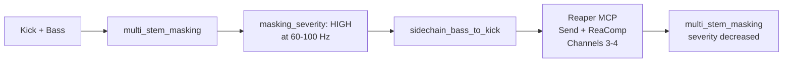

# Quick Reference: Sidechain Bass to Kick

> User says: "The bass and kick are fighting, fix the low end"

## Prerequisites

Kick and bass stems on separate tracks. Phantom and a Reaper MCP server must both be connected. See [setup-guide.md](setup-guide.md).

## Pipeline

| Stage | Who | Action | Tool/Skill |
|-------|-----|--------|------------|
| 1. Measure | Phantom MCP | `multi_stem_masking` between kick and bass | audio-diagnostician |
| 2. Confirm | Skill | Verify high masking at 60-100 Hz | mix-engineer |
| 3. Execute | Skill + Reaper MCP | Set up sidechain compression | mix-engineer |
| 4. Verify | Phantom MCP | `multi_stem_masking` again to confirm reduction | audio-diagnostician |

## Signal Flow

## What Happens at Each Stage

1. **Measure** -- Run `multi_stem_masking` between the kick and bass stems. Look for high masking severity in the sub/low bands (60-100 Hz).

2. **Confirm** -- If masking severity is "high" at 60-100 Hz, sidechain compression is the right solution. If masking is in a higher range, consider [complementary_eq_pair](../../plugin/skills/mix-engineer/reaper-recipes.md) instead.

3. **Execute** -- Follow the [sidechain_bass_to_kick](../../plugin/skills/mix-engineer/reaper-recipes.md) recipe: add a send from kick to bass on channels 3-4, insert **ReaComp** on bass, set detector to auxiliary channels 3-4, configure ratio 4:1 with fast attack.

4. **Verify** -- Run `multi_stem_masking` between kick and bass again. Masking severity at 60-100 Hz should decrease from "high" to "moderate" or "low."

## How Sidechain Routing Works in Reaper

The kick signal travels on channels 3-4 to the bass track's compressor. The compressor ducks the bass when the kick hits, then releases between hits. For details on channel routing, see [reaper-setup.md](../../plugin/skills/session-architect/reaper-setup.md).

## Cross-References

- [Sidechain recipe](../../plugin/skills/mix-engineer/reaper-recipes.md) (sidechain_bass_to_kick)
- [Complementary EQ recipe](../../plugin/skills/mix-engineer/reaper-recipes.md) (complementary_eq_pair)
- [Reaper routing details](../../plugin/skills/session-architect/reaper-setup.md)
- [Setup guide](setup-guide.md)

## Expected Time

Analysis: ~2-3 seconds. Sidechain setup: ~1-2 seconds (~3-5 MCP calls, or 1 call with TwelveTake's `setup_sidechain_compression`).
