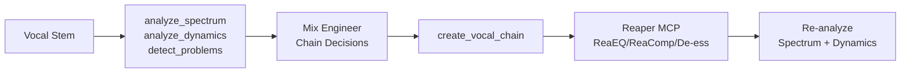

# Quick Reference: Vocal Processing Chain

> User says: "Set up a vocal chain for the lead vocal"

## Prerequisites

Vocal stem available. Phantom and a Reaper MCP server must both be connected. See [setup-guide.md](setup-guide.md).

## Pipeline

| Stage | Who | Action | Tool/Skill |
|-------|-----|--------|------------|
| 1. Analyze | Phantom MCP | `analyze_spectrum` + `analyze_dynamics` + `detect_problems` on vocal stem | audio-diagnostician |
| 2. Decide | Skill | Choose chain based on measurements | mix-engineer |
| 3. Build | Skill + Reaper MCP | Insert EQ, comp, de-ess, sends | mix-engineer |
| 4. Verify | Phantom MCP | `analyze_spectrum` + `analyze_dynamics` to confirm | audio-diagnostician |

## Signal Flow

## What Happens at Each Stage

1. **Analyze** -- Run `analyze_spectrum` to see the vocal's frequency shape. Run `analyze_dynamics` for crest factor. Run `detect_problems` to catch sibilance, mud, or noise.

2. **Decide** -- Based on measurements: mud at 200-300 Hz means cut there. Dull vocal means presence boost at 3-5 kHz. High sibilance means de-esser at 5-8 kHz. Crest factor determines compression ratio.

3. **Build** -- Follow the [create_vocal_chain](../../plugin/skills/mix-engineer/reaper-recipes.md) recipe: HPF at 80 Hz, subtractive EQ, compression (3:1, 10-20ms attack), de-esser if needed, air shelf, delay send, reverb send. Optionally add [ducked_reverb_setup](../../plugin/skills/effects-engineer/reaper-recipes.md) for reverb that stays clear during phrases.

4. **Verify** -- Run `analyze_spectrum` again. Spectral shape should be smoother. Run `analyze_dynamics` -- crest factor should decrease by 2-4 dB, confirming compression is working.

## Cross-References

- [Vocal chain recipe](../../plugin/skills/mix-engineer/reaper-recipes.md) (create_vocal_chain)
- [Ducked reverb recipe](../../plugin/skills/effects-engineer/reaper-recipes.md) (ducked_reverb_setup)
- [Setup guide](setup-guide.md)

## Expected Time

Analysis: ~2-3 seconds. Chain setup: ~1-2 seconds (~8-12 MCP calls at ~50ms each).
